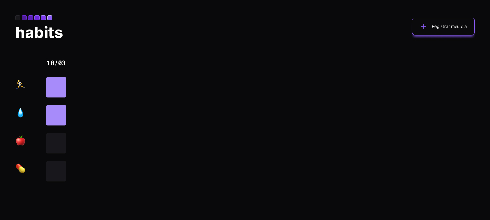

<h1 align="center"> Habits </h1>

NLW foi um evento exclusivo e gratuito, promovido pela Rocketseat para ensino de tecnologias WEB.  

  

 

  

## 🚀 Tecnologias

Esse projeto foi desenvolvido com as seguintes tecnologias:

- HTML e CSS
- JavaScript
- Git e Github
- Figma

## 💻 Projeto

O Habits é um app para ajudar a rastrear os hábitos.

- [Visite o projeto online](https://felipeLoSil.github.io)

## 🔖 Layout

Você pode visualizar o layout do projeto através [DESSE LINK](https://www.figma.com/file/EzIKoI7Wu22liHLMsRwBfI/Untitled?node-id=0%3A1&t=BrKuRs6mCUwW7sUd-1). É necessário ter conta no [Figma](https://figma.com) para acessá-lo.

## :memo: Licença

Esse projeto está sob a licença MIT.
